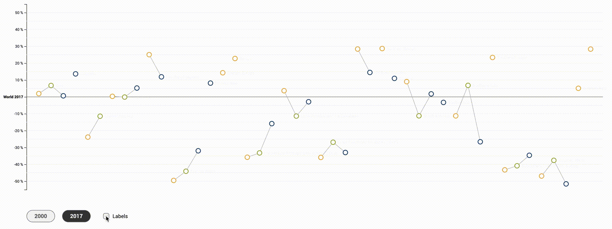
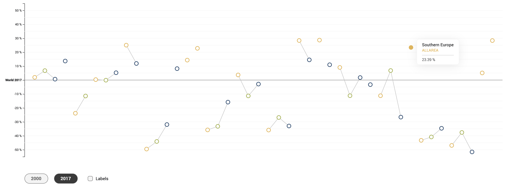
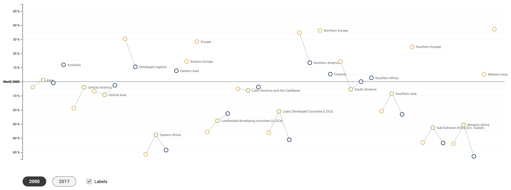

# Infographic about UN Sustainable Goal 6
This is a project I did in the course __Studio Information Aesthetics & Engineering Extended__ in my Digital Ideation studies at Lucerne University of Applied Science and Arts HSLU.

My main goal was to create an interactive diagram with __d3.js__, what wasn't possible without a long data analysis and concept phase.<br>
The final result can be found here: [un-sustainable-goal-infographic.hslu.lergier.ch](https://un-sustainable-goal-infographic.hslu.lergier.ch/)



## Dataset
As dataset we reveived the [UN Sustainable Development Goals](https://sustainabledevelopment.un.org/).<br>
I decided to work with the following data:

---

__Goal 6 Clean Water and Sanitation__:<br>
Ensure availability and sustainable management of water and sanitation for all.<br>

__Target 6.1 Universal Access__:<br>
By 2030, achieve universal and equitable access to safe and affordable drinking water for all.<br>

__Indicator 6.1.1__:<br>
Proportion of population using safely managed drinking water services.<br>

---

## Process
The first thing I did are data analysis. It's quite a big dataset so I had the challenge to find some interesting facts in it.<br>
With help from Microsoft Excel I could rearrange the document. With filters and sorting I could find my first interesting learnings:
- The access to safe drinking water in Singapore is 14 times higher than in Uganda
- 16% of people in North Macedonia lost access to safe and affordable drinking water between 2010 and 2017. In the same time, the access increased in Armenia by 57%
- Access to drinking water for European people is almost 4 times higher than people in Western Africa.

### Getting ideas
Surprised by this facts I started to create a mindmap. I tried to find out, what could be interesting to show.


### Sketches
Based on the mindmap I created some sketches of simple data diagrams. The dimensions I tried to show are the development over time, the percentage value of people with access to drinking water, some geographical informations like country, continent or just 'world', as well as the location (allarea, urban, rural).
Unfortunately the location data is missing in many geo areas.
<br><br>

I tried to make some sketches to show the difference all over the world as well. I was surprised by the high numbers of people, not having access to drinking water. Because of that, I tried to give this information a higher visibility and turned around the diagram (left).<br>
To focus on the topic of drinking water, I tried to showcase the relation between continents with some glasses of water.
<br><br>

An interesting fact I found as well is the difference in development between rural and urban areas in different countries.


In my next step I had to dive in the dataset again, select the interesting facts of my sketches and bring all this together.


### Findings
As drawn in my last sketch, I had the idea to compare the values of continents/global regions with the values from the world. In this case, the value from the world is the reference on the x-axis.

Following this idea I moved on creating sketches. I tried to illustrate the "iceberg principle" with a base line, values above and values underneath it.


Based on Sketch number 3 I created a detailled version


## Code in D3
I was new to D3.js so first of all I had to get to know how this library works. In my [links](##Links) I saved tutorial pages which helped me best.

#### Worldwide development
I created two diagrams. One simple one to visualize how the worldwide situation developed between 2000 and 2017.


#### Difference to world index
My main diagram was the one I made the concept in my sketches. It visualizes the difference of continents compared to the world index. <br>
It's made interactive so it's possible to change the year, hover points and to toggle the labels. By the way - creating this unfortunately not very nice looking labels was one of the biggest challenges in this code.

##### Initial view with Tooltip


##### View with labels


### Run the code
To run the project, clone the repo and use the following commands.<br>
The project uses webpack, which compiles all files including `scss` automatically.

Initialize project and install dependencies.
```sh
npm install
```

For __Development Environment__ with Dev-Server:
```sh
npm run dev
```

For __Production__ mode:
```sh
npm run build
```

### Challenges
I had some problems to separate the different geographical areas into groups on the x-Axis. Arriving to add some space between the different continents would improve the readability.
An article that might help to solve this problem I found here: [StackOverflow](https://stackoverflow.com/questions/37265851/d3-nested-group-as-x-axis), [jsFiddle](https://jsfiddle.net/rnoo6buy/)

---

## Links
#### Sustainable Development Goals
- Sustainable Development Goals Knowledge Platform: https://sustainabledevelopment.un.org/?menu=1300
- Sustainable Development Goal 6: https://sustainabledevelopment.un.org/sdg6
- Mapping of the UN sustainable Development Goals: https://www.sdgmapping.ch/
  - Link to Target 6.1: https://maps.kontextlab.com/client/unitednations/98#m=3/638.47616/144.88919,p=2
- Data Download: https://unstats.un.org/sdgs/indicators/database

#### D3.js
- D3: https://d3js.org/
  - Github Wiki: https://github.com/d3/d3/wiki
  - Get Started: https://observablehq.com/@d3/learn-d3
- Tutorial: https://www.tutorialsteacher.com/d3js
- Lollipop-Diagram: https://www.d3-graph-gallery.com/graph/lollipop_cleveland.html
  - Basic Lollipop: https://www.d3-graph-gallery.com/graph/lollipop_basic.html
  - Overview: https://www.d3-graph-gallery.com/lollipop.html
  - Example: http://graphics.wsj.com/gender-pay-gap/
- Multiple Line Diagram: https://www.d3-graph-gallery.com/graph/connectedscatter_multi.html
- Load Data: https://blog.bitsrc.io/how-to-create-charts-from-external-data-sources-with-d3-js-4abbcb574706
- Interactive Elements:
  - Update data: https://www.d3-graph-gallery.com/graph/lollipop_button_data_csv.html
  - Update data: https://www.d3-graph-gallery.com/graph/barplot_button_data_simple.html
  - Tooltip: https://www.d3-graph-gallery.com/graph/interactivity_tooltip.html#template
  - Tooltip: https://www.d3-graph-gallery.com/graph/scatter_tooltip.html

#### Diverses
- Pinterest Board: https://www.pinterest.ch/andrelergier/data-visualization/

